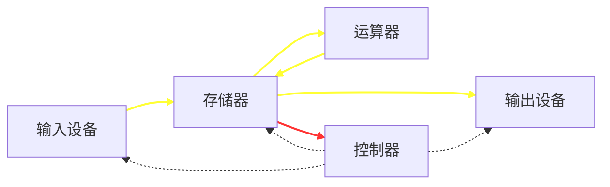

# JAVA学习笔记


## 基础知识

<center><span style="color:red">冯·诺依曼体系结构</span></center>



黄色箭头为数据流，红色箭头为指令流，虚线箭头为控制流

- 速度的计量单位是<span style="color:blue; font-size:1em;">赫兹(HZ)，1Hz相当于每秒1个脉冲。</span>时钟速度越快，在给定的时间内发送的指令越多
- 计算机就是一系列的电路开关，每个开关存在两种状态：关(off)和开(on)。如果电路是开的，那么它为1，否则为0
- <span style='color:blue'>一个0或者1存储为一个比特，是计算机中最小的存储单位。</span>
- <span style='color:blue'>计算机中最基本的存储单元是字节(byte)。</span>每个字节由8个bit构成
- 内存由一个有序的字节序列组成。<span style='color:red'>一个程序和它的数据在被CPU执行前必须移到计算机的内存中。</span>


### 命令行文件操作

- echo 要写的内容>文件名.文件格式
- md 目录名  创建目录
- del  基本文件名.后缀  删除文件
- rd 文件夹名  删除**空**的文件目录


### Java两种核心机制

- Java虚拟机（Java Virtual Machine）
- 垃圾回收机制（Garbage Collection）

<span style='color:red'>Java程序也会出现内存泄漏和内存溢出的问题！！！</span>


### JDK，JRE，JVM的关系

- JDK(Java Development Kit)：给Java开发人员使用，包含了Java的开发工具，也包括了JRE，因此，安装了JDK就不用再单独安装JRE了
  - 其中的开发工具：编译工具(javac.exe)  打包工具(jar.exe)等等

- JRE(Java Runtime Environment)：Java Runtime Environment（包括Java Plug-in）是[Sun](https://baike.baidu.com/item/Sun)的产品，包括两部分：Java Runtime Environment和Java Plug-in。JavaRuntimeEnvironment(JRE)是可以在其上运行、测试和传输应用程序的Java平台。**它包括Java虚拟机（jvm)、Java核心类库和支持文件。它不包含开发工具(JDK)--编译器、调试器和其它工具。JRE需要辅助软件--Java Plug-in--以便在浏览器中运行applet。**

**<span style='color:blue'>简单而言，使用JDK的开发工具完成的Java程序，交给JRE去运行</span>**


为什么必须写JAVA_HOME：Tomcat服务等在配置时会在path下找到JAVA_HOME的位置并调用其中的库函数，如果没有就会出错。

```java
单行注释 //这是一行注释
多行注释 
    /*这是一行
    这又是一行
    */
文档注释 注释内容可以被JDK提供的工具javadoc所解析，生成一套以网页文件形式体现的该程序的说明文档
    /**
    @Author Momoko
    @Date 2020/10/12
    */
 javadoc -d 文件名 -可选项(author,date等) Java文件名.java
```


### JAVA 语法规范

- 在一个Java源文件中可以声明多个类，<span style='color:orange'>最多有一个可以声明为public，声明为public的类为Java文件名。</span>
- 程序的入口是main()方法。格式是固定的。
- 编译：使用javac.exe命令编译java源文件。格式：javac 源文件名.java
- 运行：使用java.exe命令运行字节码文件。格式：java 类名
- <span style='color:purple'>运算符两边习惯性加上一个空格</span>
- 一个Java源文件中最多只能有一个public类，当有一个public类时，源文件名必须与之一致，否则无法编译，如果源文件中没有一个public类，则文件名与类中没有一致性要求。

- 至于main()不是必须要放在public类中才能运行程序。

- **<span style='color:blue'>关键字中所有字母都为小写</span>**
- 
- 
- Java保留字：现有Java版本尚未使用，但以后版本可能会作为关键字使用 goto，const

#### 标识符命名要求

- <span style='color:blue'>不可以用数字开头</span>
- 不可以包含空格
- 由26个英文字母大小写，0-9，或 $ 组成
- Java严格区分大小写，长度无限制。
- <span style='color:green'>不可以使用关键字和保留字，但能包含关键字和保留字</span>

#### Java定义的数据类型

- 基本数据类型：byte(1)	short(2)	int(4)	long(8)	float(4)	double(8)	boolean(true or false)

- 引用数据类型：类(calss)     接口(interface)    数组(array)
- <span style='color:green'>声明long型变量，必须以'l'或'L'结尾</span>
- <span style='color:green'>声明float型变量，必须以'f'或'F'结尾</span>
- 定义char型变量，通常使用一对''，内部只能写一个字符，<span style='color:green'>转义字符</span>，或者Unicode转义字符
- <span style='color:red'>当char、short、byte三种类型（包括同种之间）做运算时，自动类型提升结果为int</span>

#### 进制相关

- 二进制：0，1，满2进1.以0b或者0B开头
- 十进制：0-9，满10进1
- 八进制：0-7，满8进1.以数字<span style='color:red'>0</span>开头
- 十六进制：0-9及A-F，满16进1.以<span style='color:red'>0x或0X开头</span>表示。A-F不区分大小写
- 计算机以二进制<span style='color:red'>补码</span>的形式保存所有的整数

#### Java运算符

- 算术运算符
- 
- 赋值运算符：=、+=、-=、*=、/=、%=  <span style='color:red'>支持连续赋值 但是要先分别定义</span>
- 比较运算符：==、!=、<、>、<=、>=、instanceof
- 逻辑运算符：&、&&、|、||、！、^、只能用于布尔运算
  - & 和 && 的运算结果相同，当符号左边是true时，二者都会执行符号右边的运算
  - 当符号左边时false时，&继续执行符号右边的运算。&&不再执行符号右边的运算
  - | 和 || 的运算结果相同，只要有一个为true则为true
  - 当符号左边为true时，|继续执行符号右边的运算。||不在执行符号右边的运算
- 位运算符：<<、>>、>>>、&、|、^、~(取反)
  - <span style='color:red'>位运算是直接对整数的二进制进行的运算</span>
  - 面试题：最高效的方式计算2*8？ 2<<3 或 8<<1
  - \>\>(无符号右移，最高位无论是0或者1，空缺为7都用0补)
- 三元运算符：<span style='color:purple'>（条件表达式）？表达式1：表达式2；</span>
  - 条件表达式为true，结果为表达式1
  - 条件表达式为false，结果为表达式2
  - 表达式1和表达式2为<span style='color:red'>同种类型</span>
  - <span style='color:green'>优先选择使用三元运算符来替代可以用if-else的地方</span>

- <span style='color:orange'>取余运算结果的符号与被模数的符号相同</span>

- <span style='color:red'>+=等赋值运算符、自增（自减）1不会改变本身变量的数据类型且效率高</span>
- <span style='color:purple'> ==、!= 符号不仅可以使用在数值类型数据之间，还可以使用在其他引用类型变量之间</span>

#### 从键盘获取输入

从键盘获取不同类型的变量：使用Scanner类

- 导入包
- Scanner的实例化
- 使用相应的方法读取对应的变量

- <span style='color:orange'>Scanner只能获取一个字符串，不能获取单独的字符</span>

#### 条件判断

- 针对条件表达式：
  - 如果多个条件表达式之间是“互斥”关系（或没有交集的关系），哪个判断和执行语句声明在上面还是下面，无所谓
  - 如果多个条件表达式之间有交集关系，则需要仔细考虑顺序
  - 如果多个条件表达式之间有包含关系，通常情况下，需要将范围小的声明在范围大的上面。否则，范围小的就没机会执行。

- 根据switch表达式中的值依次匹配各个case中的<span style='color:red'>常量</span>，一旦匹配成功，则进入相应case中的执行语句，当调用完执行语句之后，则仍然向下执行直到遇到break关键字
- switch结构中的表达式，只能是<span style='color:red'>如下6种数据类型之一</span>：
  - byte、short、char、int、枚举类型（JDK5.0）、String类型（JDK7.0）
- default是可选的，<span style='color:orange'>且位置是灵活的，但提到前面如果没有加上break，程序会运行到break才结束。</span>

- switch-case中相同条件可以合并

#### 循环结构

- 循环语句的四个组成部分：
  - 初始化部分
  - 循环条件部分
  - 循环体部分
  - 迭代部分
- 结束循环有几种方式？
  - 方式一：循环条件部分返回false
  - 方式二：在循环体中执行break，结束当前循环
  - <span style='color:orange'>continue：结束当次循环</span>
  - <span style='color:red'>相同点：break和continue关键字后面不能声明执行语句</span>
-   带标签的break和continue，在循环前面加上标签，break label表示结束指定标识的一层循环结构 

#### 数组

- 数组，是多个相同类型数据按一定顺序排列的集合，并使用一个名字命名，并通过编号的方式
- 创建二维数组需要注意的点：
  - string[][] arr = new String\[3][]时，不可以调用arr[0]，此时并未初始化地址，这是动态初始化方式

### 对象

#### 局部变量 VS 成员变量

- 相同点
  - 定义变量的格式：数据类型 变量名 = 变量值
  - 先声明，后使用
  - 变量都有其对应的作用域
- 不同点
  - 在类中声明的位置不同
  - 属性：直接定义在类的一对{}内
  - 局部变量：声明在方法内、方法形参、代码块内、构造器形参、构造器内部的变量
  - 属性可以在声明时指明其权限，使用权限修饰符（private、public、protected，缺省）
  - 局部变量不可以使用权限修饰符
  - <span style='color:red'>局部变量没有默认的初始化值，即在调用之前一定要赋值</span>

- 在内存中的加载位置
  - 属性加载到堆空间中（非static）
  - 局部变量加载到栈空间中

#### JVM内存解析

- 编译完源程序后，生成一个或多个字节码文件
- 我们使用JVM中的类的加载器和解释器对生成的字节码文件进行解释运行意味着需要将字节码文件中对应的类加载到内存中，涉及到内存解析。
- <span style='color:purple'>匿名对象：在创建时没有显式地赋变量名，只能调用一次</span>

#### 方法

- 重载：同一个类中，存在一个以上的同名方法，只要它们的参数个数或者参数类型不同即可，<span style='color:red'>与返回值类型无关，只看参数列表</span>
- 可变个数的形参：数据类型...变量名，传入的参数个数可以是：0、1、2。。。,<span style='color:blue'>必须声明在末尾</span>
- 可变个数形参的方法与本类中方法名相同，<span style='color:orange'>形参不同</span>的方法构成重载，与方法名相同，<span style='color:red'>形参类型也相同的数组</span>之间不构成重载
- Java里方法的参数传递方式只有一种：<span style='color:red'>值传递</span>，即将实际参数值的副本传入方法内
  - 形参是基本数据类型：将实参基本数据类型变量的”数据值“传递给形参
  - 形参是引用数据类型：将实参引用数据类型变量的<span style='color:red'>”地址值“</span>传递给形参

#### 封装

- 封装性的体现<span style='color:red'>(之一)</span>：将类的属性私有化，同时提供公共的方法来获取和设置属性的值；不对外暴露私有的方法；单例模式。。。

- 封装性的体现需要权限修饰符来配合：private，缺省、protected、public

- | 修饰符    | 类内部 | 同一个包 | 不同包的子类 | 同一个工程 |
  | --------- | ------ | -------- | ------------ | ---------- |
  | private   | Yes    | No       | No           | No         |
  | 缺省      | Yes    | Yes      | No           | No         |
  | protected | Yes    | Yes      | Yes          | No         |
  | public    | Yes    | Yes      | Yse          | Yse        |

- <span style='color:orange'>对于class的权限修饰只可以用public和default(缺省)</span>

- 没有显式的定义构造器，则系统默认提供一个空参的构造器，权限默认与类的定义权限一致。<span style='color:red'>一旦定义了类的构造器，则系统不再提供默认的空参构造器</span>
- 定义构造器的格式：权限修饰符 类名（形参列表）{}

- JavaBean是一种可重用的组件
  - <span style='color:red'>类是公共的</span>
  - <span style='color:red'>有一个空参的公共的构造器</span>
  - <span style='color:red'>有属性，且有对应的get，set方法</span>
- this调用构造器
  - 在类的构造器中，可以显式的使用“this(形参列表)"可以调用本类中其他的构造器
  - <span style='color:red'>“this(形参列表)"必须声明在当前构造器首行，所以最多只能声明一个“this(形参列表)"</span>
- package关键字
  - 为了更好的实现项目中类的管理，出现包的概念
  - 使用package声明类或接口所属的包，声明在源文件的首行
- import关键字
  - 在源文件中显式的使用import导入指定包下的类、接口
  - 声明在包的声明和类的声明之间
  - 使用的类或者接口是java.lang包下定义的，则可省略
  - 如果在源文件中，使用了不同包下的同名的类，则必须至少有一个类需要以<span style='color:orange'>全类名</span>的方式显示
  - import static:导入指定类或接口中的静态的属性或者方法

#### 继承

- 格式：class A extends B{}
- 一旦子类A继承父类B以后，子类A中就获取了父类B中声明的所有属性、方法
- <span style='color:red'>特别的，父类中声明为private的属性或方法，子类继承父类以后，仍然认为获取了父类中私有的结构，只是因为封装性的影响，子类不能直接调用父类的私有结构。</span>
- Java只支持<span style='color:purple'>单继承和多层继承</span>
- **方法的重写**：子类中根据需要对从父类中继承来的方法进行改造，执行程序时，子类的方法将覆盖父类的方法
  - 子类重写的方法必须和父类被重写的方法具有相同的<span style='color:red'>方法名称、参数列表</span>
  - 子类重写的方法的返回值类型<span style='color:red'>不能大于</span>父类被重写的方法的返回值类型
    - 父类被重写的返回值类型是基本数据类型（double），则子类重写的方法的返回值类型必须是相同的基本数据类型（double）
  - 子类重写的方法使用的访问权限<span style='color:red'>不能小于</span>父类被重写的方法的访问权限
    - <span style='color:orange'>子类不能重写父类中声明为private权限的方法</span>
  - 子类方法抛出的异常不能大于父类被重写方法的异常
  - 可变个数形参认为是重写了父类中同名同参函数中带有数组的方法
    - 父类 int add(int a, int[] arr)  子类 int add(int a, int... arr)这时子类重写了父类的方法
- **super关键字**：可以用此关键字调用父类的属性，方法，构造器
  - super(形参列表)必须声明在子类构造器的首行
  - 在类的构造器中，针对于this(形参列表)和super(形参列表)只能二选一
  - <span style='color:orange'>在构造器的首行，没有显式声明this(形参列表)或super(形参列表)</span>，<span style='color:red'>默认调用super()</span>

#### 多态

- 对象的多态性：父类的引用指向子类的对象（或子类的对象赋给父类的引用）
- 多态的使用：虚拟方法调用（类的继承关系、方法的重写）
  - 在编译器，只能调用父类中声明的方法，在运行期，实际执行的是子类重写父类的方法
  - 编译时看左边，运行时看右边
- <span style='color:red'>对象的多态性，只适用于方法，不适用于属性。</span>
- 有了对象的多态性以后，内存中实际上是加载了子类特有的属性和方法的，但是由于变量声明为父类类型，导致编译时，只能调用父类中声明的属性和方法，子类特有的属性和方法不能调用。<span style='color:red'>使用强制类型转换来获取子类的对象</span>

- **instanceof**关键字（a instanceof A)
  - 在向下转型时，先判断对象a是否是类A的实例。如果是，返回true；如果不是，返回false

#### java.lang.Object

- Obejct类是所有java类的根父类
- 如果在类的声明中未使用extends关键字指明其父类，则默认父类为java.lang.object类
- object类中的属性和方法具有通用性 
- 当我们输出一个对象的引用时，实际上就是调用当前对象的toString方法

#### 包装类的使用

- 针对八种基本数据类型定义相应的引用类型—包装类（封装类）

- | 基本数据类型 |  包装类   |
  | :----------: | :-------: |
  |     byte     |   Byte    |
  |    short     |   Short   |
  |     int      |  Integer  |
  |     long     |   Long    |
  |    float     |   Float   |
  |    double    |  Double   |
  |   boolean    |  Boolean  |
  |     char     | Character |

  

- <span style='color:red'>JDK5.0新特性：自动装箱与自动拆箱</span>

#### static 关键字

- static可以用来修饰属性、方法、代码块、内部类
- static修饰属性时，表明该属性是该类的所有对象公有的，当通过某一个对象修改静态变量时，会导致其他对象调用此静态变量时，是修改过了的。
- 静态变量、方法随着类的加载而加载
- 静态方法中不能使用非静态的方法或属性
- 在静态方法中，不能使用this，或super关键字
- 单例模式：在整个软件系统中，<span style='color:red'>对某个类只能存在一个对象实例</span>，将类的构造器的访问权限设置为private，调用该类的某个静态方法以返回类内部创建的对象。
- <span style='color:red'>注意：</span>static关键字修饰的变量若在父类中，子类自动获得，如果子类并没有定义同名的变量，则子类与父类的该变量共用同一个值，即为同一个static变量

#### final关键字

- final 可以用来修饰的结构：类、方法、变量
- final 用来修饰一个类：此类不能被其他类所继承。如：String类、System类、StringBuffer类
- final 用来修饰方法：表明此方法不可以被重写

- final 用来修饰变量：此时的变量称为是一个常量
  - final 修饰属性：可以考虑赋值的位置有：显式初始化、代码块中初始化、构造器中初始化

#### 接口

- 解决类继承多个类的属性和方法的问题
- 继承是一个”是不是“的关系，而接口实现则是”能不能“的关系
- 类可实现（implements）多个接口，但是只能继承（extends）一个父类，如果实现类覆盖了接口中的所有抽象方法，则实现类可以实例化，否则变成抽象类
  - 格式：class AA extends BB implements CC,DD
- 如何定义接口：定义接口的成员
  - JDK7以前，只能定义全局常量和抽象方法
    - 全局常量：public static final的，书写时可以省略不写
    - 抽象方法：public abstract的
  - JDK8，除了定义全局常量和抽象方法之外，<span style='color:blue'>还可以定义静态方法，默认方法</span>
    - 接口中定义的静态方法，只能通过接口来调用
    - default 方法可被实现类直接调用
    - 如果实现类重写了接口中的默认方法，调用时，仍然调用的是重写后的方法
    - 如果子类（或实现类）继承的父类和实现的接口中声明了同名同参数的方法，子类在没有重写此方法的情况下，默认调用的是父类中同名同参数方法。 

- <span style='color:red'>接口中不能定义构造器，意味着接口不可以实例化</span>
- <span style='color:purple'>接口与接口之间可以多继承</span>

#### 内部类

- Java中，允许一个类的定义位于另一个类的内部，前者称为<span style='color:blue'>内部类</span>，后者称为<span style='color:blue'>外部类</span>

- Inner class 一般用在定义它的类或语句块之内，在外部引用它时必须给出完整的名称。

  - <span style='color:blue'>Inner class的名字不能与包含它的外部类类名相同</span>

- 分类

  - 成员内部类（static成员内部类和非static成员内部类）
    - 作为外部类的成员，可以调用外部类的结构，可以被四种不同的权限修饰
    - 类内可以定义属性、方法、构造器
  - 局部内部类（不谈修饰符）、匿名内部类（方法内、代码内、构造器内。。。）

- 在局部内部类的方法中，如果调用局部内部类所在的声明的方法中的局部变量，则要求此局部变量声明为final的

- ```Java
  public class AA{
  	public void method() {
          //局部变量
          int num = 10 //JDK8以后编译器不报错，但是默认为final的，不可修改
          class AA {
              public void show() {
                  System.out.println(num);
              }
          }
      }
  }
  ```

### 异常

- Java程序在执行过程中所发生的异常事件可分为两类

- **<span style='color:blue'>Error:</span>** Java虚拟机无法解决的严重问题。如：JVM系统内部错误，资源耗尽等严重情况。如StackoverflowError和OOM。

- **<span style='color:blue'>Exception:</span>**其它因编程错误或偶然的外在因素导致的一般性问题，可以使用针对性的代码进行处理。例如：

  - 空指针访问
  - 试图读取不存在的文件
  - 网络连接中断
  - 数组角标越界等等

- ```java
  try {
      //可能出现的异常
  } catch() {
      //处理异常的方式
  } finally {
      //一定会执行的代码
  }
  ```

- finally是可选的

- finally中声明的是一定会被执行的代码。即使catch中又出现异常了，try中有return语句，catch中有return语句等等。

- 数据库连接、输入输出流、网络编程Socket等资源，JVM不能自动回收，需要手动释放，这些资源的释放则可以放到finally中

- 如何选择使用try-catch-finally还是throws
  - 如果父类中被重写的方法没有throws方式处理异常，则子类重写的方法也不能使用throws，意味着如果子类重写的方法中有异常，必须使用try-catch-finally方式处理
  - 执行的方法中，先后又调用了另外的几个方法，这几个方法是递进关系执行的，建议使用throws方式进行处理，在最外层的方法里面try-catch
- 如何自定义异常？
  1. 继承于现有的异常结构：RuntimeException、Exception（常用这两个）
  2. 提供全局常量：serialVersionUID
  3. 提供重载的构造器

- throw和throws的区别
  - throw是声明异常的方式，生成一个异常对象，是”抛“异常的方式，throws是异常处理的方式，是”抓“异常的方式

### 线程

- 程序是一段静态的代码。进程是正在运行的一个程序，<span style='color:red'>作为资源分配的单位</span>。而线程则是程序内部的一条执行路径。<span style='color:red'>线程作为调度和执行的单位，每个线程拥有独立的运行栈和程序计数器（pc）。</span>
- 何时需要多线程
  - 程序需要同时执行两个或多个任务，或需要一些后台运行的程序时。
  - 程序需要实现一些需要等待的任务，如用户输入、文件读写操作、网络操作、搜索等。

#### 创建多线程的方式

- **方式一**：继承于Thread类

  1. 创建一个继承于Thread类的子类
  2. 重写Thread类中的run方法
  3. 创建Thread类的子类的对象
  4. 通过此对象调用start()方法,，start方法有如下两个作用
     - 启动当前线程
     - 调用当前线程的run()

- 如果该Thread只用一次，可以考虑创建Thread类的匿名子类来启动线程

- ```java
  //创建Thread类的匿名子类
          new Thread(){
              @Override
              public void run() {
                  //do something
              }
          }.start();
  ```

- Thread中的常用方法

  - start()：启动当前线程；调用当前线程的run()
  - run()：通常需要重写Thread类中的此方法，将创建的线程要执行的操作声明在此方法中
  - currentThread()：静态方法，返回执行当前代码的线程
  - getName()：获取当前线程的名字
  - setName()：设置当前线程的名字
  - yield()：表明当前线程愿意释放当前cpu的执行权，但是调度器可忽略此提示
  - join()：在线程A中调用线程B的join方法，此时线程A进入阻塞状态，直到线程B完全执行完以后，线程A才结束阻塞状态
  - sleep(long millis)：阻塞当前线程指定的时间
  - isAlive()：判断当前线程是否死亡

- 线程的优先级等级

  - MAX_PRIORITY:10
  - MIN_PRIORITY:1
  - NORM_PRIORITY:5
  - 线程创建时继承父线程的优先级
  - 低优先级只是获得调度的概率低，并非一定是在高优先级线程之后才被调用

- **方式二**：实现Runnable接口

  1. 创建实现Runnable接口的类
  2. 实现类去实现Runnable中的抽象方法：run()
  3. 创建此类的对象
  4. 将此对象作为参数传递到Thread类的构造器中，创建Thread类的对象
  5. 通过Thread类的对象调用start()

- ```
  Java线程的状态有以下几种：
  
   New：新创建的线程，尚未执行；
   Runnable：运行中的线程，正在执行run()方法的Java代码；
   Blocked：运行中的线程，因为某些操作被阻塞而挂起；
   Waiting：运行中的线程，因为某些操作在等待中；
   Timed Waiting：运行中的线程，因为执行sleep()方法正在计时等待；
   Terminated：线程已终止，因为run()方法执行完毕。
  
   用一个状态转移图表示如下：
  
            ┌─────────────┐
            │     New     │
            └─────────────┘
                   │
                   ▼
   ┌ ─ ─ ─ ─ ─ ─ ─ ─ ─ ─ ─ ─ ─ ─ ─ ┐
    ┌─────────────┐ ┌─────────────┐
   ││  Runnable   │ │   Blocked   ││
    └─────────────┘ └─────────────┘
   │┌─────────────┐ ┌─────────────┐│
    │   Waiting   │ │Timed Waiting│
   │└─────────────┘ └─────────────┘│
    ─ ─ ─ ─ ─ ─ ─ ─ ─ ─ ─ ─ ─ ─ ─ ─
                   │
                   ▼
            ┌─────────────┐
            │ Terminated  │
            └─────────────┘
  ```


- **方式三**：实现Callable接口
  - 相比run()方法，可以有返回值
  - 方法可以抛出异常
  - 支持泛型的返回值
  - 需要借助FutureTask类，比如获取返回结果
- Future接口
  - 可以对具体Runnable、Callable任务的执行结果进行取消、查询是否完成、获取结果等。
  - FutureTask是Future接口的唯一实现类

#### 线程同步

- 方式一：同步代码块

- ```java
  synchronized(同步监视器) {
      //需要被同步的代码
  }
  说明：1.操作共享数据的代码，即为需要被同步的代码  -->不能包含代码多了，也不能包含代码少了
       2.共享数据：多个线程共同操作的变量
       3.同步监视器，俗称：锁。任何一个类的对象，都可以充当锁
      	要求：多个线程必须要共用同一把锁。
      补充：在实现Runnable接口的创建多线程的方式中，可以考虑使用this作为锁
      在继承Thread类创建多线程的方式中，考虑使用当前类对象作为锁
  ```

- 同步的方式，解决了线程的安全问题。操作同步代码时，只能有一个线程参与，其他线程等待。

- 方式二：同步方法

  - 如果操作共享数据的代码完整的声明在一个方法中，不妨将此方法声明为同步的
  - 同步方法人仍然涉及到同步监视器，只是不需要显式的声明
  - 非静态的同步方法，同步监视器是：this
  - 静态的同步方法，同步监视器是：当前类本身

#### 死锁

- 不同的线程分别占用对方需要的同步资源不放弃，都在等待对方放弃自己需要的同步资源，形成线程的死锁
- 尽量减少同步资源的定义，尽量避免嵌套同步
- 从JDK5.0开始，JAVA提供通过显式定义同步锁对象来实现同步。同步锁使用Lock对象充当。
- ReentrantLock可以替代synchronized进行同步；ReentrantLock获取锁更安全；必须先获取到锁，再进入try {...}代码块，最后使用finally保证释放锁； 可以使用tryLock()尝试获取锁。
- wait()：调用wait()的线程会进入阻塞状态且会释放锁
- notify()：一旦执行此方法，就会唤醒被wait的一个线程。如果有多个线程，则唤醒优先级高的线程。
- notifyAll()：一旦执行此方法，就会唤醒被wait的所有线程
- <span style='color:red'>上述三个方法必须使用在同步代码块或者同步方法中，且三个方法的调用者必须是同步代码块或同步方法中的同步监视器</span>