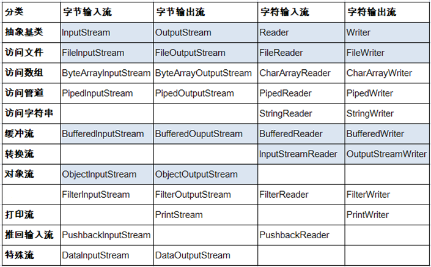

# JAVA学习笔记


## 基础知识

<center><span style="color:red">冯·诺依曼体系结构</span></center>


黄色箭头为数据流，红色箭头为指令流，虚线箭头为控制流

- 速度的计量单位是<span style="color:blue; font-size:1em;">赫兹(HZ)，1Hz相当于每秒1个脉冲。</span>时钟速度越快，在给定的时间内发送的指令越多
- 计算机就是一系列的电路开关，每个开关存在两种状态：关(off)和开(on)。如果电路是开的，那么它为1，否则为0
- <span style='color:blue'>一个0或者1存储为一个比特，是计算机中最小的存储单位。</span>
- <span style='color:blue'>计算机中最基本的存储单元是字节(byte)。</span>每个字节由8个bit构成
- 内存由一个有序的字节序列组成。<span style='color:red'>一个程序和它的数据在被CPU执行前必须移到计算机的内存中。</span>


### 命令行文件操作

- echo 要写的内容>文件名.文件格式
- md 目录名  创建目录
- del  基本文件名.后缀  删除文件
- rd 文件夹名  删除**空**的文件目录


### Java两种核心机制

- Java虚拟机（Java Virtual Machine）
- 垃圾回收机制（Garbage Collection）

<span style='color:red'>Java程序也会出现内存泄漏和内存溢出的问题！！！</span>


### JDK，JRE，JVM的关系

- JDK(Java Development Kit)：给Java开发人员使用，包含了Java的开发工具，也包括了JRE，因此，安装了JDK就不用再单独安装JRE了
  - 其中的开发工具：编译工具(javac.exe)  打包工具(jar.exe)等等

- JRE(Java Runtime Environment)：Java Runtime Environment（包括Java Plug-in）是[Sun](https://baike.baidu.com/item/Sun)的产品，包括两部分：Java Runtime Environment和Java Plug-in。JavaRuntimeEnvironment(JRE)是可以在其上运行、测试和传输应用程序的Java平台。**它包括Java虚拟机（jvm)、Java核心类库和支持文件。它不包含开发工具(JDK)--编译器、调试器和其它工具。JRE需要辅助软件--Java Plug-in--以便在浏览器中运行applet。**

**<span style='color:blue'>简单而言，使用JDK的开发工具完成的Java程序，交给JRE去运行</span>**


为什么必须写JAVA_HOME：Tomcat服务等在配置时会在path下找到JAVA_HOME的位置并调用其中的库函数，如果没有就会出错。

```java
单行注释 //这是一行注释
多行注释 
    /*这是一行
    这又是一行
    */
文档注释 注释内容可以被JDK提供的工具javadoc所解析，生成一套以网页文件形式体现的该程序的说明文档
    /**
    @Author Momoko
    @Date 2020/10/12
    */
 javadoc -d 文件名 -可选项(author,date等) Java文件名.java
```


### JAVA 语法规范

- 在一个Java源文件中可以声明多个类，<span style='color:orange'>最多有一个可以声明为public，声明为public的类为Java文件名。</span>
- 程序的入口是main()方法。格式是固定的。
- 编译：使用javac.exe命令编译java源文件。格式：javac 源文件名.java
- 运行：使用java.exe命令运行字节码文件。格式：java 类名
- <span style='color:purple'>运算符两边习惯性加上一个空格</span>
- 一个Java源文件中最多只能有一个public类，当有一个public类时，源文件名必须与之一致，否则无法编译，如果源文件中没有一个public类，则文件名与类中没有一致性要求。

- 至于main()不是必须要放在public类中才能运行程序。

- **<span style='color:blue'>关键字中所有字母都为小写</span>**
- 
- 
- Java保留字：现有Java版本尚未使用，但以后版本可能会作为关键字使用 goto，const

#### 标识符命名要求

- <span style='color:blue'>不可以用数字开头</span>
- 不可以包含空格
- 由26个英文字母大小写，0-9，或 $ 组成
- Java严格区分大小写，长度无限制。
- <span style='color:green'>不可以使用关键字和保留字，但能包含关键字和保留字</span>

#### Java定义的数据类型

- 基本数据类型：byte(1)	short(2)   char(2)	int(4)	long(8)	float(4)	double(8)	boolean(true or false)

- 引用数据类型：类(calss)     接口(interface)    数组(array)
- <span style='color:green'>声明long型变量，必须以'l'或'L'结尾</span>
- <span style='color:green'>声明float型变量，必须以'f'或'F'结尾</span>
- 定义char型变量，通常使用一对''，内部只能写一个字符，<span style='color:green'>转义字符</span>，或者Unicode转义字符
- <span style='color:red'>当char、short、byte三种类型（包括同种之间）做运算时，自动类型提升结果为int</span>

#### 进制相关

- 二进制：0，1，满2进1.以0b或者0B开头
- 十进制：0-9，满10进1
- 八进制：0-7，满8进1.以数字<span style='color:red'>0</span>开头
- 十六进制：0-9及A-F，满16进1.以<span style='color:red'>0x或0X开头</span>表示。A-F不区分大小写
- 计算机以二进制<span style='color:red'>补码</span>的形式保存所有的整数

#### Java运算符

- 算术运算符
- 
- 赋值运算符：=、+=、-=、*=、/=、%=  <span style='color:red'>支持连续赋值 但是要先分别定义</span>
- 比较运算符：==、!=、<、>、<=、>=、instanceof
- 逻辑运算符：&、&&、|、||、！、^、只能用于布尔运算
  - & 和 && 的运算结果相同，当符号左边是true时，二者都会执行符号右边的运算
  - 当符号左边时false时，&继续执行符号右边的运算。&&不再执行符号右边的运算
  - | 和 || 的运算结果相同，只要有一个为true则为true
  - 当符号左边为true时，|继续执行符号右边的运算。||不在执行符号右边的运算
- 位运算符：<<、>>、>>>、&、|、^、~(取反)
  - <span style='color:red'>位运算是直接对整数的二进制进行的运算</span>
  - 面试题：最高效的方式计算2*8？ 2<<3 或 8<<1
  - \>\>(无符号右移，最高位无论是0或者1，空缺为7都用0补)
- 三元运算符：<span style='color:purple'>（条件表达式）？表达式1：表达式2；</span>
  - 条件表达式为true，结果为表达式1
  - 条件表达式为false，结果为表达式2
  - 表达式1和表达式2为<span style='color:red'>同种类型</span>
  - <span style='color:green'>优先选择使用三元运算符来替代可以用if-else的地方</span>

- <span style='color:orange'>取余运算结果的符号与被模数的符号相同</span>

- <span style='color:red'>+=等赋值运算符、自增（自减）1不会改变本身变量的数据类型且效率高</span>
- <span style='color:purple'> ==、!= 符号不仅可以使用在数值类型数据之间，还可以使用在其他引用类型变量之间</span>

#### 从键盘获取输入

从键盘获取不同类型的变量：使用Scanner类

- 导入包
- Scanner的实例化
- 使用相应的方法读取对应的变量

- <span style='color:orange'>Scanner只能获取一个字符串，不能获取单独的字符</span>

#### 条件判断

- 针对条件表达式：
  - 如果多个条件表达式之间是“互斥”关系（或没有交集的关系），哪个判断和执行语句声明在上面还是下面，无所谓
  - 如果多个条件表达式之间有交集关系，则需要仔细考虑顺序
  - 如果多个条件表达式之间有包含关系，通常情况下，需要将范围小的声明在范围大的上面。否则，范围小的就没机会执行。

- 根据switch表达式中的值依次匹配各个case中的<span style='color:red'>常量</span>，一旦匹配成功，则进入相应case中的执行语句，当调用完执行语句之后，则仍然向下执行直到遇到break关键字
- switch结构中的表达式，只能是<span style='color:red'>如下6种数据类型之一</span>：
  - byte、short、char、int、枚举类型（JDK5.0）、String类型（JDK7.0）
- default是可选的，<span style='color:orange'>且位置是灵活的，但提到前面如果没有加上break，程序会运行到break才结束。</span>

- switch-case中相同条件可以合并

#### 循环结构

- 循环语句的四个组成部分：
  - 初始化部分
  - 循环条件部分
  - 循环体部分
  - 迭代部分
- 结束循环有几种方式？
  - 方式一：循环条件部分返回false
  - 方式二：在循环体中执行break，结束当前循环
  - <span style='color:orange'>continue：结束当次循环</span>
  - <span style='color:red'>相同点：break和continue关键字后面不能声明执行语句</span>
-   带标签的break和continue，在循环前面加上标签，break label表示结束指定标识的一层循环结构 

#### 数组

- 数组，是多个相同类型数据按一定顺序排列的集合，并使用一个名字命名，并通过编号的方式
- 创建二维数组需要注意的点：
  - string[][] arr = new String\[3][]时，不可以调用arr[0]，此时并未初始化地址，这是动态初始化方式

### 对象

#### 局部变量 VS 成员变量

- 相同点
  - 定义变量的格式：数据类型 变量名 = 变量值
  - 先声明，后使用
  - 变量都有其对应的作用域
- 不同点
  - 在类中声明的位置不同
  - 属性：直接定义在类的一对{}内
  - 局部变量：声明在方法内、方法形参、代码块内、构造器形参、构造器内部的变量
  - 属性可以在声明时指明其权限，使用权限修饰符（private、public、protected，缺省）
  - 局部变量不可以使用权限修饰符
  - <span style='color:red'>局部变量没有默认的初始化值，即在调用之前一定要赋值</span>

- 在内存中的加载位置
  - 属性加载到堆空间中（非static）
  - 局部变量加载到栈空间中

#### JVM内存解析

- 编译完源程序后，生成一个或多个字节码文件
- 我们使用JVM中的类的加载器和解释器对生成的字节码文件进行解释运行意味着需要将字节码文件中对应的类加载到内存中，涉及到内存解析。
- <span style='color:purple'>匿名对象：在创建时没有显式地赋变量名，只能调用一次</span>

#### 方法

- 重载：同一个类中，存在一个以上的同名方法，只要它们的参数个数或者参数类型不同即可，<span style='color:red'>与返回值类型无关，只看参数列表</span>
- 可变个数的形参：数据类型...变量名，传入的参数个数可以是：0、1、2。。。,<span style='color:blue'>必须声明在末尾</span>
- 可变个数形参的方法与本类中方法名相同，<span style='color:orange'>形参不同</span>的方法构成重载，与方法名相同，<span style='color:red'>形参类型也相同的数组</span>之间不构成重载
- Java里方法的参数传递方式只有一种：<span style='color:red'>值传递</span>，即将实际参数值的副本传入方法内
  - 形参是基本数据类型：将实参基本数据类型变量的”数据值“传递给形参
  - 形参是引用数据类型：将实参引用数据类型变量的<span style='color:red'>”地址值“</span>传递给形参

#### 封装

- 封装性的体现<span style='color:red'>(之一)</span>：将类的属性私有化，同时提供公共的方法来获取和设置属性的值；不对外暴露私有的方法；单例模式。。。

- 封装性的体现需要权限修饰符来配合：private，缺省、protected、public

- | 修饰符    | 类内部 | 同一个包 | 不同包的子类 | 同一个工程 |
  | --------- | ------ | -------- | ------------ | ---------- |
  | private   | Yes    | No       | No           | No         |
  | 缺省      | Yes    | Yes      | No           | No         |
  | protected | Yes    | Yes      | Yes          | No         |
  | public    | Yes    | Yes      | Yse          | Yse        |

- <span style='color:orange'>对于class的权限修饰只可以用public和default(缺省)</span>

- 没有显式的定义构造器，则系统默认提供一个空参的构造器，权限默认与类的定义权限一致。<span style='color:red'>一旦定义了类的构造器，则系统不再提供默认的空参构造器</span>
- 定义构造器的格式：权限修饰符 类名（形参列表）{}

- JavaBean是一种可重用的组件
  - <span style='color:red'>类是公共的</span>
  - <span style='color:red'>有一个空参的公共的构造器</span>
  - <span style='color:red'>有属性，且有对应的get，set方法</span>
- this调用构造器
  - 在类的构造器中，可以显式的使用“this(形参列表)"可以调用本类中其他的构造器
  - <span style='color:red'>“this(形参列表)"必须声明在当前构造器首行，所以最多只能声明一个“this(形参列表)"</span>
- package关键字
  - 为了更好的实现项目中类的管理，出现包的概念
  - 使用package声明类或接口所属的包，声明在源文件的首行
- import关键字
  - 在源文件中显式的使用import导入指定包下的类、接口
  - 声明在包的声明和类的声明之间
  - 使用的类或者接口是java.lang包下定义的，则可省略
  - 如果在源文件中，使用了不同包下的同名的类，则必须至少有一个类需要以<span style='color:orange'>全类名</span>的方式显示
  - import static:导入指定类或接口中的静态的属性或者方法

#### 继承

- 格式：class A extends B{}
- 一旦子类A继承父类B以后，子类A中就获取了父类B中声明的所有属性、方法
- <span style='color:red'>特别的，父类中声明为private的属性或方法，子类继承父类以后，仍然认为获取了父类中私有的结构，只是因为封装性的影响，子类不能直接调用父类的私有结构。</span>
- Java只支持<span style='color:purple'>单继承和多层继承</span>
- **方法的重写**：子类中根据需要对从父类中继承来的方法进行改造，执行程序时，子类的方法将覆盖父类的方法
  - 子类重写的方法必须和父类被重写的方法具有相同的<span style='color:red'>方法名称、参数列表</span>
  - 子类重写的方法的返回值类型<span style='color:red'>不能大于</span>父类被重写的方法的返回值类型
    - 父类被重写的返回值类型是基本数据类型（double），则子类重写的方法的返回值类型必须是相同的基本数据类型（double）
  - 子类重写的方法使用的访问权限<span style='color:red'>不能小于</span>父类被重写的方法的访问权限
    - <span style='color:orange'>子类不能重写父类中声明为private权限的方法</span>
  - 子类方法抛出的异常不能大于父类被重写方法的异常
  - 可变个数形参认为是重写了父类中同名同参函数中带有数组的方法
    - 父类 int add(int a, int[] arr)  子类 int add(int a, int... arr)这时子类重写了父类的方法
- **super关键字**：可以用此关键字调用父类的属性，方法，构造器
  - super(形参列表)必须声明在子类构造器的首行
  - 在类的构造器中，针对于this(形参列表)和super(形参列表)只能二选一
  - <span style='color:orange'>在构造器的首行，没有显式声明this(形参列表)或super(形参列表)</span>，<span style='color:red'>默认调用super()</span>

#### 多态

- 对象的多态性：父类的引用指向子类的对象（或子类的对象赋给父类的引用）
- 多态的使用：虚拟方法调用（类的继承关系、方法的重写）
  - 在编译器，只能调用父类中声明的方法，在运行期，实际执行的是子类重写父类的方法
  - 编译时看左边，运行时看右边
- <span style='color:red'>对象的多态性，只适用于方法，不适用于属性。</span>
- 有了对象的多态性以后，内存中实际上是加载了子类特有的属性和方法的，但是由于变量声明为父类类型，导致编译时，只能调用父类中声明的属性和方法，子类特有的属性和方法不能调用。<span style='color:red'>使用强制类型转换来获取子类的对象</span>

- **instanceof**关键字（a instanceof A)
  - 在向下转型时，先判断对象a是否是类A的实例。如果是，返回true；如果不是，返回false

#### java.lang.Object

- Obejct类是所有java类的根父类
- 如果在类的声明中未使用extends关键字指明其父类，则默认父类为java.lang.object类
- object类中的属性和方法具有通用性 
- 当我们输出一个对象的引用时，实际上就是调用当前对象的toString方法

#### 包装类的使用

- 针对八种基本数据类型定义相应的引用类型—包装类（封装类）

- | 基本数据类型 |  包装类   |
  | :----------: | :-------: |
  |     byte     |   Byte    |
  |    short     |   Short   |
  |     int      |  Integer  |
  |     long     |   Long    |
  |    float     |   Float   |
  |    double    |  Double   |
  |   boolean    |  Boolean  |
  |     char     | Character |

  

- <span style='color:red'>JDK5.0新特性：自动装箱与自动拆箱</span>

#### static 关键字

- static可以用来修饰属性、方法、代码块、内部类
- static修饰属性时，表明该属性是该类的所有对象公有的，当通过某一个对象修改静态变量时，会导致其他对象调用此静态变量时，是修改过了的。
- 静态变量、方法随着类的加载而加载
- 静态方法中不能使用非静态的方法或属性
- 在静态方法中，不能使用this，或super关键字
- 单例模式：在整个软件系统中，<span style='color:red'>对某个类只能存在一个对象实例</span>，将类的构造器的访问权限设置为private，调用该类的某个静态方法以返回类内部创建的对象。
- <span style='color:red'>注意：</span>static关键字修饰的变量若在父类中，子类自动获得，如果子类并没有定义同名的变量，则子类与父类的该变量共用同一个值，即为同一个static变量

#### final关键字

- final 可以用来修饰的结构：类、方法、变量
- final 用来修饰一个类：此类不能被其他类所继承。如：String类、System类、StringBuffer类
- final 用来修饰方法：表明此方法不可以被重写

- final 用来修饰变量：此时的变量称为是一个常量
  - final 修饰属性：可以考虑赋值的位置有：显式初始化、代码块中初始化、构造器中初始化

#### 接口

- 解决类继承多个类的属性和方法的问题
- 继承是一个”是不是“的关系，而接口实现则是”能不能“的关系
- 类可实现（implements）多个接口，但是只能继承（extends）一个父类，如果实现类覆盖了接口中的所有抽象方法，则实现类可以实例化，否则变成抽象类
  - 格式：class AA extends BB implements CC,DD
- 如何定义接口：定义接口的成员
  - JDK7以前，只能定义全局常量和抽象方法
    - 全局常量：public static final的，书写时可以省略不写
    - 抽象方法：public abstract的
  - JDK8，除了定义全局常量和抽象方法之外，<span style='color:blue'>还可以定义静态方法，默认方法</span>
    - <span style='color:red'>接口中定义的静态方法，只能通过接口来调用</span>
    - default 方法可被实现类直接调用
    - 如果实现类重写了接口中的默认方法，调用时，仍然调用的是重写后的方法
    - 如果子类（或实现类）继承的父类和实现的接口中声明了同名同参数的方法，子类在没有重写此方法的情况下，默认调用的是父类中同名同参数方法。 

- <span style='color:red'>接口中不能定义构造器，意味着接口不可以实例化</span>
- <span style='color:purple'>接口与接口之间可以多继承，使用extends关键字</span>

#### 内部类

- Java中，允许一个类的定义位于另一个类的内部，前者称为<span style='color:blue'>内部类</span>，后者称为<span style='color:blue'>外部类</span>

- Inner class 一般用在定义它的类或语句块之内，在外部引用它时必须给出完整的名称。

  - <span style='color:blue'>Inner class的名字不能与包含它的外部类类名相同</span>

- 分类

  - 成员内部类（static成员内部类和非static成员内部类）
    - 作为外部类的成员，可以调用外部类的结构，可以被四种不同的权限修饰
    - 类内可以定义属性、方法、构造器
  - 局部内部类（不谈修饰符）、匿名内部类（方法内、代码内、构造器内。。。）

- 在局部内部类的方法中，如果调用局部内部类所在的声明的方法中的局部变量，则要求此局部变量声明为final的

- ```Java
  public class AA{
  	public void method() {
          //局部变量
          int num = 10 //JDK8以后编译器不报错，但是默认为final的，不可修改
          class AA {
              public void show() {
                  System.out.println(num);
              }
          }
      }
  }
  ```

### 异常

- Java程序在执行过程中所发生的异常事件可分为两类

- **<span style='color:blue'>Error:</span>** Java虚拟机无法解决的严重问题。如：JVM系统内部错误，资源耗尽等严重情况。如StackoverflowError和OOM。

- **<span style='color:blue'>Exception:</span>**其它因编程错误或偶然的外在因素导致的一般性问题，可以使用针对性的代码进行处理。例如：

  - 空指针访问
  - 试图读取不存在的文件
  - 网络连接中断
  - 数组角标越界等等

- ```java
  try {
      //可能出现的异常
  } catch() {
      //处理异常的方式
  } finally {
      //一定会执行的代码
  }
  ```

- finally是可选的

- finally中声明的是一定会被执行的代码。即使catch中又出现异常了，try中有return语句，catch中有return语句等等。

- 数据库连接、输入输出流、网络编程Socket等资源，JVM不能自动回收，需要手动释放，这些资源的释放则可以放到finally中

- 如何选择使用try-catch-finally还是throws
  - 如果父类中被重写的方法没有throws方式处理异常，则子类重写的方法也不能使用throws，意味着如果子类重写的方法中有异常，必须使用try-catch-finally方式处理
  - 执行的方法中，先后又调用了另外的几个方法，这几个方法是递进关系执行的，建议使用throws方式进行处理，在最外层的方法里面try-catch
- 如何自定义异常？
  1. 继承于现有的异常结构：RuntimeException、Exception（常用这两个）
  2. 提供全局常量：serialVersionUID
  3. 提供重载的构造器

- throw和throws的区别
  
  - throw是声明异常的方式，生成一个异常对象，是”抛“异常的方式，throws是异常处理的方式，是”抓“异常的方式

### 线程

- 程序是一段静态的代码。进程是正在运行的一个程序，<span style='color:red'>作为资源分配的单位</span>。而线程则是程序内部的一条执行路径。<span style='color:red'>线程作为调度和执行的单位，每个线程拥有独立的运行栈和程序计数器（pc）。</span>
- 何时需要多线程
  - 程序需要同时执行两个或多个任务，或需要一些后台运行的程序时。
  - 程序需要实现一些需要等待的任务，如用户输入、文件读写操作、网络操作、搜索等。

#### 创建多线程的方式

- **方式一**：继承于Thread类

  1. 创建一个继承于Thread类的子类
  2. 重写Thread类中的run方法
  3. 创建Thread类的子类的对象
  4. 通过此对象调用start()方法,，start方法有如下两个作用
     - 启动当前线程
     - 调用当前线程的run()

- 如果该Thread只用一次，可以考虑创建Thread类的匿名子类来启动线程

- ```java
  //创建Thread类的匿名子类
          new Thread(){
              @Override
              public void run() {
                  //do something
              }
          }.start();
  ```

- Thread中的常用方法

  - start()：启动当前线程；调用当前线程的run()
  - run()：通常需要重写Thread类中的此方法，将创建的线程要执行的操作声明在此方法中
  - currentThread()：静态方法，返回执行当前代码的线程
  - getName()：获取当前线程的名字
  - setName()：设置当前线程的名字
  - yield()：表明当前线程愿意释放当前cpu的执行权，但是调度器可忽略此提示
  - join()：在线程A中调用线程B的join方法，此时线程A进入阻塞状态，直到线程B完全执行完以后，线程A才结束阻塞状态
  - sleep(long millis)：阻塞当前线程指定的时间
  - isAlive()：判断当前线程是否死亡

- 线程的优先级等级

  - MAX_PRIORITY:10
  - MIN_PRIORITY:1
  - NORM_PRIORITY:5
  - 线程创建时继承父线程的优先级
  - 低优先级只是获得调度的概率低，并非一定是在高优先级线程之后才被调用

- **方式二**：实现Runnable接口

  1. 创建实现Runnable接口的类
  2. 实现类去实现Runnable中的抽象方法：run()
  3. 创建此类的对象
  4. 将此对象作为参数传递到Thread类的构造器中，创建Thread类的对象
  5. 通过Thread类的对象调用start()

- ```
  Java线程的状态有以下几种：
  
   New：新创建的线程，尚未执行；
   Runnable：运行中的线程，正在执行run()方法的Java代码；
   Blocked：运行中的线程，因为某些操作被阻塞而挂起；
   Waiting：运行中的线程，因为某些操作在等待中；
   Timed Waiting：运行中的线程，因为执行sleep()方法正在计时等待；
   Terminated：线程已终止，因为run()方法执行完毕。
  
   用一个状态转移图表示如下：
  
            ┌─────────────┐
            │     New     │
            └─────────────┘
                   │
                   ▼
   ┌ ─ ─ ─ ─ ─ ─ ─ ─ ─ ─ ─ ─ ─ ─ ─ ┐
    ┌─────────────┐ ┌─────────────┐
   ││  Runnable   │ │   Blocked   ││
    └─────────────┘ └─────────────┘
   │┌─────────────┐ ┌─────────────┐│
    │   Waiting   │ │Timed Waiting│
   │└─────────────┘ └─────────────┘│
    ─ ─ ─ ─ ─ ─ ─ ─ ─ ─ ─ ─ ─ ─ ─ ─
                   │
                   ▼
            ┌─────────────┐
            │ Terminated  │
            └─────────────┘
  ```


- **方式三**：实现Callable接口  ——JDK5.0新增
  - 相比run()方法，可以有返回值
  - 方法可以抛出异常
  - 支持泛型的返回值
  - 需要借助FutureTask类，比如获取返回结果
- Future接口
  - 可以对具体Runnable、Callable任务的执行结果进行取消、查询是否完成、获取结果等。
  - <span style='color:blue'>FutureTask是Future的具体实现</span>
  - FutureTask同时实现了Runnable，Future接口，它既可以作为Runnable被线程实行，又可以作为Future得到Callable的返回值。
- 步骤：

  1. 创建一个实现Callable的实现类
  2. 实现call方法，将此线程需要执行的操作声明在call()中
  3. 创建Callable接口实现类的对象
  4. 将此对象作为参数传递到FutureTask的构造器中，创建FutureTask的对象
  5. 将FutureTask的对象作为参数传递到Thread类的构造器中，创建Thread对象，并调用start()
  6. 获取Callable方法中返回值
- **方式四**：使用线程池
- 提前创建好多个线程，放入线程池中，使用时直接获取，使用完放回池中，可以避免频繁创建销毁，实现重复利用。
- ExecutorService：真正的线程池接口。常见子类ThreadPoolExecutor

  - void execute(Runnable command)：执行任务/命令，没有返回值，一般用来执行Runnable
  - <T>Future<T> submit(Callable<T> task)：执行任务，有返回值，一般用来执行Callable
  - void shutdown()：关闭连接池
- Executors：工具类、线程池的工厂类，用于创建并返回不同类型的线程池

  - Executors.newCachedThreadPool()：创建一个可根据需要创建新线程的线程池
  - Executors.newFixedThreadPool(n)：创建一个可重用固定线程数的线程池
  - Executors.newSingleThreadExecutor()：创建一个只有一个线程的线程池

#### 线程同步

- 方式一：同步代码块

- ```java
  synchronized(同步监视器) {
      //需要被同步的代码
  }
  说明：1.操作共享数据的代码，即为需要被同步的代码  -->不能包含代码多了，也不能包含代码少了
       2.共享数据：多个线程共同操作的变量
       3.同步监视器，俗称：锁。任何一个类的对象，都可以充当锁
      	要求：多个线程必须要共用同一把锁。
      补充：在实现Runnable接口的创建多线程的方式中，可以考虑使用this作为锁
      在继承Thread类创建多线程的方式中，考虑使用当前类对象作为锁
  ```

- 同步的方式，解决了线程的安全问题。操作同步代码时，只能有一个线程参与，其他线程等待。

- 方式二：同步方法（给方法加上synchronized关键字）

  - 如果操作共享数据的代码完整的声明在一个方法中，不妨将此方法声明为同步的
  - 同步方法仍然涉及到同步监视器，只是不需要显式的声明
  - <span style='color:red'>非静态的同步方法，同步监视器是：this</span>
  - <span style='color:red'>静态的同步方法，同步监视器是：当前类本身</span>

#### 死锁

- 不同的线程分别占用对方需要的同步资源不放弃，都在等待对方放弃自己需要的同步资源，形成线程的死锁

- 尽量减少同步资源的定义，尽量避免嵌套同步

- 从JDK5.0开始，JAVA提供通过显式定义同步锁对象来实现同步。同步锁使用Lock对象充当。

- ReentrantLock可以替代synchronized进行同步；ReentrantLock获取锁更安全；必须先获取到锁，再进入try {...}代码块，最后使用finally保证释放锁； 可以使用tryLock()尝试获取锁。

- ```Java
  class Window5 implements Runnable {
      //需要加static才能同步，还有问题
      private int ticket = 100;
  
      //1.实例化ReentrantLock
      private ReentrantLock lock = new ReentrantLock();
  
      @Override
      public void run() {
          while (true) {
              try {
                  //2.调用lock()
                  lock.lock();
                  if (ticket > 0) {
                      try {
                          sleep(100);
                      } catch (InterruptedException e) {
                          e.printStackTrace();
                      }
                      System.out.println(currentThread().getName() + ":卖票，票号为:" + ticket);
                      ticket--;
                  } else {
                      break;
                  }
              } finally {
                  //3.调用解锁的方法
                  lock.unlock();
              }
          }
      }
  }
  ```

- wait()：调用wait()的线程会进入阻塞状态且会释放锁

- notify()：一旦执行此方法，就会唤醒被wait的一个线程。如果有多个线程，则唤醒优先级高的线程。

- notifyAll()：一旦执行此方法，就会唤醒被wait的所有线程

- <span style='color:red'>上述三个方法必须使用在同步代码块或者同步方法中，且三个方法的调用者必须是同步代码块或同步方法中的同步监视器</span>

- 创建JAVA类进行单元测试，此JAVA类要求：
  * 此类是public的
  * 此类提供公共的无参的构造器
    * 单元测试方法权限是public且没有返回值类型，没有形参
  * 此单元测试方法上需要声明注解，@Test

### 常用类

#### String类

- String：代表不可变的字符序列，简称：不可变性
  - 通过字面量（String s = "abc"）的方式给一个字符串赋值，此时的字符串值声明在<span style='color:purple'>字符串常量池</span>中
  - 当对字符串重新赋值时，需要重写指定内存区域赋值，不能使用原有的value赋值
  - 当对现有的字符串进行连接操作时，也需要重新指定内存区域赋值，不能使用原有的value赋值
  - <span style='color:purple'> 字符串常量池中是不会储存相同内容的字符串的</span>
- String 的实例化方式：
  - 通过字面量定义的方式
  - 通过new + 构造器的方式
- 常量于常量的拼接在常量池中。且常量池中不会存储相同内容的常量
- <span style='color:orange'>如果拼接的结果调用intern()方法，返回值就在常量池中。</span>

#### String、StringBuffer、StringBuilder三者的异同

- String：不可变的字符序列；底层使用char[]存储
- StringBuffer：可变的字符序列；<span style='color:red'>线程安全的（方法都加上了synchronized关键字）</span>，效率低；底层使用char[]存储
- StringBuilder：可变的字符序列；线程不安全的，效率高；底层使用char[]存储  ——JDK5.0新增的

#### Date类

- java.utils.Date类
  - |---java.sql.Date类
- 两个构造器的使用
  - 构造器一：Date()：创建一个对应当前时间的Date对象
  - 构造器二：创建指定毫秒数的Date对象
- 两个方法的使用
  - toString()：显示当前的年、月、日、时、分、秒
  - getTime()：获取当前Date对象对应的毫秒数。（时间戳）

#### java.text.SimpleDateFormat类

- 格式化：日期—>文本、解析：文本—>日期
- 格式化：
  - SimpleDateFormat()：默认的模式和语言环境创建对象
  - public SimpleDateFormat(String pattern)：用指定格式创建一个对象
  - <span style='color:green'>public String format(Date date) </span>：方法格式化时间对象date
- 解析：
  - public Date parse(String source)：从给定字符串的开始解析文本，以生成一个日期

#### java.util.Calendar类

- 获取Calendar(抽象类)实例的方法
  - 使用<span style='color:red'>Calendar.getInstance()</span>方法：其实返回的也是GregorianCalendar子类对象
  - 调用它的子类<span style='color:red'>GregorianCalendar</span>的构造器

- 一个Calendar的实例时系统时间的抽象表示，通过<span style='color:red'>get(int field)</span>方法来取得想要的时间信息。比如YEAR、MONTH、DAY_OFWEEK、HOUR_OF_DAY、MINUTE、SECOND等
  - <span style='color:red'>public void set(int field,int value)</span>
  - <span style='color:red'>public void add(int field,int amount)</span>
  - <span style='color:red'>public final Date getTime()</span>
  - <span style='color:red'>public void setTime(Date date)</span>
- 注意：
  - 获取月份时：一月是0，二月是1，以此类推，12月是11
  - 获取星期时：周日是1，周二是2，。。。周六是7

#### LocalDate、LocalTime、LocalDateTime  ——JDK8.0新增

- 它们的实例是<span style='color:red'>不可变对象</span>，分别表示使用ISO-8601日历系统的日期、时间、日期与时间。提供了简单的本地日期或时间，并不包含当前的时间信息，也不包含与时区相关的信息。

- ```java
  对于某一个时间戳，给它关联上指定的ZoneId，就得到了ZonedDateTime，
  继而可以获得了对应时区的LocalDateTime
    LocalDateTime，ZoneId，Instant，ZonedDateTime和long都可以互相转换：
    ┌─────────────┐
    │LocalDateTime│────┐
    └─────────────┘    │    ┌─────────────┐
                       ├───>│ZonedDateTime│
    ┌─────────────┐    │    └─────────────┘
    │   ZoneId    │────┘           ▲
    └─────────────┘      ┌─────────┴─────────┐
                         │                   │
                         ▼                   ▼
                  ┌─────────────┐     ┌─────────────┐
                  │   Instant   │<───>│    long     │
                  └─────────────┘     └─────────────┘
  
   
  ```

- 对日期和时间进行调整则使用withXxx()方法

  - 调整年：withYear()
  - 调整月：withMonth()
  - 调整日：withDayOfMonth()
  - 调整时：withHour()
  - 调整分：withMinute()
  - 调整秒：withSecond()

#### Comparable接口

- 重写CompareTo(obj)的规则
  - 如果当前对象this大于形参对象obj，则返回正整数
  - 如果当前对象this小于形参对象obj，则返回负整数
  - 如果当前对象this等于形参对象obj，则返回零

- 对于自定义类，如果需要排序，可让自定义类事项Comparable接口，重现CompareTo(obj)方法

#### Comparator接口：定制排序

- 当元素的类型没有实现Comparable接口而又不方便修改代码或者实现了java.lang.Comparable接口的排序规则不适合当前的操作，那么看可以考虑使用Comparator的对象来排序
- 重写compare(T o1, T o2)方法，比较o1和o2的大小  

### 枚举类

- 枚举类的理解：类的对象只有<span style='color:purple'>有限个，确定的</span>。称此类为枚举类

- <span style='color:blue'>当需要定义一组常量时，建议使用枚举类</span>
- 定义枚举类：
  - jdk5.0之前，自定义枚举类
    - 声明枚举类对象的属性:private final修饰
    - 私有化类的构造器，并给对象赋属性值
    - 提供当前枚举类的对各对象：public static final的
    - 其他诉求：获取枚举类对象的属性
  - jdk5.0，可以使用enum关键字定义枚举类，定义的枚举类默认继承于java.lang.Enum
    - 使用enum关键字代替class关键字
    - 提供当前枚举类的对各对象：多个对象之间用逗号隔开，末尾对象分号结束，此时需要省略public static final
      - 例如：SPRING("春天","春暖花开")
    - 声明枚举类对象的属性:private final修饰
    - 私有化类的构造器，并给对象赋属性值
    - 其他诉求：获取枚举类对象的属性

- Enum类的主要方法
  - <span style='color:red'>values()方法</span>：返回枚举类型的对象数组。该方法可以很方便地遍历所有的枚举值
  - <span style='color:red'>valueOf(String str)</span>：可以把一个字符串转为对应的枚举类对象。<span style='color:red'>要求字符串必须是枚举类对象的“名字”</span>。如不是，会有运行时异常。
  - <span style='color:red'>toString()</span>：返回当前枚举类对象常量的名称
- 使用enum关键字定义的枚举类实现接口的情况
  - 实现接口，在enum类中实现抽象方法（常规套路）
  - 让枚举类的对象分别实现接口中的抽象方法

### 注解

- JDK5.0增加的对元数据（MetaData）的支持
- Annotation其实即使代码里的<span style='color:blue'>特殊标记</span>，这些标记可以在编译，类加载，运行时被读取，并执行相应的处理。
- Annotation可以像修饰符一样被使用，可用于<span style='color:red'>修饰包，类，构造器，方法，成员变量，参数，局部变量的声明</span>，这些信息被保存在Annotation的"name=value"对中
- 在编译时进行格式检查（JDK内置的三个基本注解）
  - @Override：限定重写父类方法，该注解只能用于方法
  - @Deprecated：用于表示所修饰的元素（类，方法等）已过时
  - @SuppressWarnings：抑制编译器警告
- 如何自定义注解，自定义注解自动继承了<span style='color:blue'>java.lang.Annotation接口</span>
  - 使用@interface关键字
  - 成员变量使用无参数方法的形式来声明，其方法名和返回值定义了该成员的名字和类型。类型只能是<span style='color:blue'>八种基本数据类型、String类型、Class类型、enum类型、Annotation类型、以上所有类型的数组</span>
  - 可以在定义Annotation的成员变量时为其指定初始值，指定成员变量的初始值可使用<span style='color:blue'>default关键字</span>
  - 如果只有一个参数成员，建议使用<span style='color:blue'>参数名为value</span>
  - 如果定义的注解含有配置参数，那么使用时必须指定参数值，除非它有默认值。格式是”参数名 = 参数值“，如果只有一个参数成员，且名称为value，可以省略”value=“
- jdk提供的四种元注解（修饰注解的注解）
  - Retention：用于指定该Annotation的生命周期（SOURCE\CLASS\RUNTIME）
  - Target：用于指定被修饰的Annotation能用于修饰哪些程序元素。包含名为value的成员变量
  - Documented：用于指定被Annotation修饰的Annotation类将被javadoc解析时，保留下来
  - Inherited：被它修饰的Annotation将具有<span style='color:red'>继承性</span>。如果某个类使用了被@Inherited修饰的Annotation，则其子类将自动具有该注解。
- jdk 8中注解的新特性：可重复注解、类型注解
  - 可重复注解：@Repeatable()
    - 在MyAnnotation上声明@Repeatable，成员值为MyAnnotations.class
    - MyAnnotation的Targe、Rentention等元注解和MyAnnotations相同
  - 类型注解：
    - ElementType.TYPE_PARAMETER 表示该注解能写在类型变量的声明语句中（如：泛型声明）
    - ElementType.TYPE_USE 表示该注解能写在使用类型的任何语句中

### 集合

- 集合、数组都是对多个数据进行存储操作的结构，简称Java容器。
- 

#### Collection接口：单列集合，用来存储一个一个的对象

##### list接口：存储<span style='color:red'>有序的、可重复的</span>数据

- ArrayList：作为List接口的主要实现类，线程不安全的，效率高，底层使用Object[]存储
- LinkedList：对于频繁的插入、删除操作，使用此类比ArrayList高，底层使用双向链表存储
- Vector：作为List接口的古老实现类，线程安全的，效率低，底层使用Object[]存储

##### set接口：存储<span style='color:blue'>无序的、不可重复的</span>数据

- 无序性：<span style='color:blue'>不等于随机性。以HashSet为例说明，存储的数据在底层数组中并非按照数组索引的顺序添加，而是根据数据的哈希值</span>
- 不可重复性：保证添加的元素按照equals()判断时，不能返回true.即：相同的元素只能添加一个（其中要重写hashCode()方法）
- HashSet：作为Set接口的主要实现类，线程不安全的，可以存储null值
  - LinkedHashSet：作为HashSet的子类，遍历其内部数据时，可以按照添加的顺序遍历
- TreeSet：底层使用红黑树存储，可以按照添加对象的指定属性，进行排序

- 集合元素的遍历操作，使用Iterator接口，使用内部的next()、hasNext()方法
  - <span style='color:blue'>集合对象每次调用iterator()方法都得到一个全新的迭代器对象</span>，默认游标都在集合的第一个元素之前
  - 内部定义了remove()，可以在遍历的是时候，删除集合中的元素。此方法不同于集合直接调用remove()
- java 5.0提供了foreach循环迭代访问Collection和数组
  - 遍历操作不需要获取Collection或数组的长度，无需使用索引访问元素。
  - <span style='color:blue'>遍历集合的底层调用Iterator完成操作</span>
- <span style='color:red'>向Set中添加的数据，其所在的类一定要重写hashCode()和equals()</span>
  - 要求：重写的hashCode()和equals()尽可能保持一致性：相等的对象必须要相等的散列码
- 向TreeSet中添加的数据，要求是同类的对象
  - 向TreeSet中添加的自定义类需要实现比较方式：自然排序（实现Comparable接口）和定制排序（Comparator）
  - 自然排序中，比较两个对象是否相同的标准为：compareTo()返回0。不再是equals()。
- <span style='color:red'>Set添加元素的过程：以HashSet为例：</span>

  - 向HashSet中添加元素a，首先调用元素a所在类的hashCode()方法，计算a的哈希值，此哈希值接着通过某种算法计算出在HashSet底层数组中的存放位置（即为：索引位置），判断数组此位置上是否已经有元素：

    - 如果此位置上没有其他元素，则元素a添加成功。  ——>情况1
    - 如果此位置上有其他元素b（或以链表形式存在着多个元素），则比较元素a与元素b的hash值:
      - 如果hash值不相同，则元素a添加成功。  ——>情况2
      - 如果hash值相同，进而需要调用元素a所在类的equals()方法：
        - equals()返回true，元素a添加失败
        - equals()返回false，则元素a添加成功   ——>情况2

    - 对于添加成功的情况2和情况3而言：元素a与已经存在指定索引位置上数据以链表的方式存储。（jdk7和jdk8指向方式有所不同）
- <span style='color:red'>Set的remove方法也会先调用a的hashCode()方法判断底层数组上是否有该元素，如果有则删除成功，没有就删除失败</span>。

##### Map接口：双列集合，用来存储一对（key-value）一对的数据

- HashMap：作为Map的主要实现类，线程不安全的，效率高；可以存储null的key和value
  
  - LinkedHashMap：保证在遍历map元素时，可以按照添加的顺序实现遍历。原因：在原有的HashMap底层结构基础上，添加了一对指针，指向前一个和后一个元素。对于频繁的遍历操作，此类执行效率高于HashMap。
  
- TreeMap：保证按照添加的key-value对进行排序，实现排序遍历。此时考虑key的自然排序或定制排序，底层使用红黑树

  - 要求key必须是由同一个类创建的对象，因为要按照key进行排序

- HashTable：作为古老的实现类，线程安全的，效率低；不能存储null的key和value
  
  - Properties：常用来处理配置文件。<span style='color:red'>key和value都是String类型</span>
  
- Map结构的理解（以HashMap为例）：

  - Map中的key：无序的、不可重复的，使用Set存储所有的key  ——><span style='color:blue'>key所在的类要重写equals()和hashCode()  </span>
  - Map中的value：无序的、不可重复的，使用Collection存储所有的value    ——><span style='color:blue'>value所在的类要重写equals()</span>
  - Map中每put一对key和value，实质上是put一个Entry，Entry中有key和value属性，相应地，Entry是无序不可重复的。

- <span style='color:red'>HashMap的底层实现原理（以jdk7为例说明）</span>

- ```java
  HashMap map = new HashMap();
  在实例化以后，底层创建了长度是16的一维数组Entry[] table.
  ...可能已经执行过多次put...
  map.put(key1,value1);
  首先，调用key1所在类的hashCode()计算key1的哈希值，此哈希值经过某种算法计算以后，得到在Entry数组中的存放位置
  如果此位置上的数据为空，此时的key1-value1添加成功(Entry添加成功)  ---->情况1
  如果此位置上的数据不为空，比较key1和已经存在的一个或多的数据的哈希值：
      如果key1的哈希值与已经存在的数据的哈希值都不相同，此时key1-value1添加成功。  ---->情况2
      如果key1的哈希值和已经存在的某一个数据(key2-value2)的哈希值相同，继续比较：调用key1所在类的equals(key2)方法，比较：
          如果equals返回false：此时key1-value1添加成功  ---->情况3
          如果equals返回true：使用value1替换value2
      补充：关于情况2和情况3，此时key1-value1和原来的数据以链表的方式存储
      在不断的添加过程中，会涉及到扩容问题，当超出临界值（且要存放的位置非空时）默认的扩容方式：扩容为原来容量的2倍，并把原来的数据复制过来。
  ```

- <span style='color:red'>jdk8 相较于jdk7在底层实现方面的不同：</span>

- ```Java
  new HashMap():底层没有创建一个长度为16的数组
  jdk8底层的数组是Node[]而非Entry[]
  首次调用put()方法时，底层创建长度为16的数组
  jdk7底层结构只有：数组+链表。jdk8中的底层结构：数组+链表+红黑树
      当数组中的某一个索引位置上的元素以链表形式存在的个数 > 8 且当前的数组的长度 > 64时，
      此时此索引位置上的所有数据改为使用红黑树存储。
  DEFAULT_INITIAL_CAPACITY：HashMap的默认容量，16
  MAXIMUM_CAPACITY：HashMap的最大支持容量，2^30
  DEFAULT_LOAD_FACTOR：HashMap的默认加载因子，0.75f
  TREEIFY_THRESHOLD：Bucket中链表长度大于该默认值，转化为红黑树，8
  UNTREEIFY_THRESHOLD：Bucket中红黑树存储的Node小于该默认值，转化为链表，6
  MIN_TREEIFY_CAPACITY：Bucket中Node被树化时最小的hash表容量，64
  ```

#### Collections工具类

- <span style='color:red'>Collections是一个操作Set，List和Map等集合的工具类（可生成线程安全的List、Set和Map）</span>
- 排序操作（均为static方法）(还有很多其他的方法，需要时了解)
  - reverse(List)：反转List中元素的顺序
  - shuffle(List)：对List集合元素进行随机排序
  - sort(List)：根据元素的自然顺序对指定List集合元素按升序排序
  - sort(List, Comparator)：根据指定的Comparator产生的顺序对List集合元素进行排序
  - swap(List, int, int)：将指定list集合中的 i 处元素和 j 处元素进行交换

### 泛型

- 允许在定义类、接口时通过一个标识表示类中某个属性的类型或者是某个方法的返回值及参数类型。这个类型参数将在使用时（例如，继承或者实现这个接口，用这个类型声明变量、创建对象时）确定（即传入实际的类型参数，也称为类型实参）

- <span style='color:red'>注意点：泛型的类型必须是类，不能是基本数据类型。需要用到基本数据类型的位置，拿包装类代替</span>

- jdk7新特性：类型推断，Map<String, Integer> map = new HashMap<>();

- 如何自定义泛型结构：泛型类、泛型接口；泛型方法

  - 泛型类：public class Demo<T> {} ，T表示未知类型。
  - 泛型接口：public interface ImplDemo<T,V>{} ，和定义类一样(接口就是一个特殊类)。
  - 泛型方法：public <span style='color:blue'>\<T\></span>  void demo1(T name){System.out.println(name);} , public  <span style='color:blue'>\<T\></span> T demo2(T t){ return t;}
    - 在方法中出现了泛型的结构，泛型参数与类的泛型参数没有任何关系
    -  <span style='color:orange'>泛型方法所属的类是不是泛型类都没有关系</span>

- 泛型类可能由多个参数，此时应该将多个参数一起放在尖括号内。如：<E1, E2, E3>

- <span style='color:purple'>泛型类的构造器如下：public GenericClass(){}</span>

- 如果泛型类是一个接口或抽象类，则不可创建泛型类的对象

- 泛型的不同引用不能互相赋值

- <span style='color:purple'>静态方法中不能使用类的泛型，但是泛型方法可以声明为静态的。原因：泛型参数是在调用方法时确定的，并非在实例化类时确定</span>

- 异常类不能是泛型的

- 通配符 <span style='color:purple'> ？ </span>的使用：

  -  ```java
    List<Objcet> list1 = null;
    List<String> list2 = null;
    List<?> list = null;
    list = list1;   //可赋值
    list = list2;
    ```

  - 添加：对于List<?>就不能向其内部添加数据，除了null之外 
  
  - 读取：允许读取数据，读取的数据类型为Object。
  
  - 注意点：
  
    - 不能用在泛型方法声明上，返回值类型前面不能使用
    - 不能用在泛型类的声明上
    -  不能用在创建对象上，右边属于创建集合对象
       ArrayList\<?> list2 = new ArrayList<?>();
  
- 有限制条件的通配符使用

  - ？ extends Number:只允许泛型为Number及Number子类的引用调用（≤）
  - ？super Number:只允许泛型为Number及Number父类的引用调用（≥）
  - ？ extends Comparable:只允许泛型实现Comparable接口的实现类的引用调用

 ### IO流

#### File类

- File类的一个对象，代表一个文件或者一个文件目录

  - createNewFile()：创建文件
  - mkdir()：创建文件目录，如果此文件上层目录不存在，则创建失败
  - mkdirs()：创建文件目录，如果上层文件目录不存在，一并创建
  - delete()：删除文件或者文件夹
  - exists()：文件或者文件夹是否存在

- File类中设计到关于文件或文件目录的创建、删除、重命名、修改时间、文件大小等方法，并未涉及到写入或者读取文件内容的操作。如果需要读取或写入文件内容，必须使用IO流来完成。

- IO流体系

- 

- <i>转自廖雪峰的Java教程IO一讲</i>

- Java的IO标准库提供的<kbd>InputStream</kbd>根据来源可以包括：

  - <kbd>FileInputStream</kbd>：从文件读取数据，是最终数据源；
  - <kbd>-ServletInputStream</kbd>：从HTTP请求读取数据，是最终数据源；
  - <kbd>Socket.getInputStream()</kbd>：从TCP连接读取数据，是最终数据源；
  - ...

- 如果我们要给<kbd>FileInputStream</kbd>添加缓冲功能，则可以从<kbd>FileInputStream</kbd>派生一个类：

  ```BufferedFileInputStream extends FileInputStream```

- 如果要给<kbd>FileInputStream</kbd>添加计算签名的功能，类似的，也可以从<kbd>FileInputStream</kbd>派生一个类：

  ```DigestFileInputStream extends FileInputStream```

- 如果要给<kbd>FileInputStream</kbd>添加加密/解密功能，还是可以从<kbd>FileInputStream</kbd>派生一个类：

  ```CipherFileInputStream extends FileInputStream```

- 如果要给<kbd>FileInputStream</kbd>添加缓冲和签名的功能，那么我们还需要派生<kbd>BufferedDigestFileInputStream</kbd>。如果要给<kbd>FileInputStream</kbd>添加缓冲和加解密的功能，则需要派生<kbd>BufferedCipherFileInputStream</kbd>。

  我们发现，给<kbd>FileInputStream</kbd>添加3种功能，至少需要3个子类。这3种功能的组合，又需要更多的子类：

  ```
                            ┌─────────────────┐
                            │ FileInputStream │
                            └─────────────────┘
                                     ▲
               ┌───────────┬─────────┼─────────┬───────────┐
               │           │         │         │           │
  ┌───────────────────────┐│┌─────────────────┐│┌─────────────────────┐
  │BufferedFileInputStream│││DigestInputStream│││CipherFileInputStream│
  └───────────────────────┘│└─────────────────┘│└─────────────────────┘
                           │                   │
      ┌─────────────────────────────┐ ┌─────────────────────────────┐
      │BufferedDigestFileInputStream│ │BufferedCipherFileInputStream│
      └─────────────────────────────┘ └─────────────────────────────┘
  
  ```

  

  因此，直接使用继承，为各种<kbd>InputStream</kbd>附加更多的功能，根本无法控制代码的复杂度，很快就会失控。

  为了解决依赖继承会导致子类数量失控的问题，JDK首先将<kbd>InputStream</kbd>分为两大类：

  一类是直接提供数据的基础<kbd>InputStream</kbd>，例如：

  - FileInputStream
  - ByteArrayInputStream
  - ServletInputStream
  - ...

    一类是提供额外附加功能的<kbd>InputStream</kbd>，例如：

  - BufferedInputStream
  - DigestInputStream
  - CipherInputStream
  - ...

    当我们需要给一个“基础”<kbd>InputStream</kbd>附加各种功能时，我们先确定这个能提供数据源的<kbd>InputStream</kbd>，因为我们需要的数据总得来自某个地方，例如，<kbd>FileInputStream</kbd>，数据来源自文件：

  ```InputStream file = new FileInputStream("com.momoko.test.gz");```
  紧接着，我们希望<kbd>FileInputStream</kbd>能提供缓冲的功能来提高读取的效率，因此我们用<kbd>BufferedInputStream</kbd>包装这个<kbd>InputStream</kbd>，得到的包装类型是<kbd>BufferedInputStream</kbd>，但它仍然被视为一个<kbd>InputStream</kbd>：

  ```InputStream buffered = new BufferedInputStream(file);```
  最后，假设该文件已经用gzip压缩了，我们希望直接读取解压缩的内容，就可以再包装一个<kbd>GZIPInputStream</kbd>：

  ```InputStream gzip = new GZIPInputStream(buffered);```
  无论我们包装多少次，得到的对象始终是<kbd>InputStream</kbd>，我们直接用<kbd>InputStream</kbd>来引用它，就可以正常读取：

  ```
  ┌─────────────────────────┐
  │GZIPInputStream          │
  │┌───────────────────────┐│
  ││BufferedFileInputStream││
  ││┌─────────────────────┐││
  │││   FileInputStream   │││
  ││└─────────────────────┘││
  │└───────────────────────┘│
  └─────────────────────────┘
  
  ```

  上述这种通过一个“基础”组件再叠加各种“附加”功能组件的模式，称之为Filter模式（或者装饰器模式：Decorator）。它可以让我们通过少量的类来实现各种功能的组合：

  ```                       
                   ┌─────────────┐
                   │ InputStream │
                   └─────────────┘
                         ▲ ▲
  ┌────────────────────┐ │ │ ┌─────────────────┐
  │  FileInputStream   │─┤ └─│FilterInputStream│
  └────────────────────┘ │   └─────────────────┘
  ┌────────────────────┐ │     ▲ ┌───────────────────┐
  │ByteArrayInputStream│─┤     ├─│BufferedInputStream│
  └────────────────────┘ │     │ └───────────────────┘
  ┌────────────────────┐ │     │ ┌───────────────────┐
  │ ServletInputStream │─┘     ├─│  DataInputStream  │
  └────────────────────┘       │ └───────────────────┘
                               │ ┌───────────────────┐
                               └─│CheckedInputStream │
                                 └───────────────────┘     
  ```


  类似的，<kbd>OutputStream</kbd>也是以这种模式来提供各种功能：

  ```
                    ┌─────────────┐
                    │OutputStream │
                    └─────────────┘
                          ▲ ▲
  ┌─────────────────────┐ │ │ ┌──────────────────┐
  │  FileOutputStream   │─┤ └─│FilterOutputStream│
  └─────────────────────┘ │   └──────────────────┘
  ┌─────────────────────┐ │     ▲ ┌────────────────────┐
  │ByteArrayOutputStream│─┤     ├─│BufferedOutputStream│
  └─────────────────────┘ │     │ └────────────────────┘
  ┌─────────────────────┐ │     │ ┌────────────────────┐
  │ ServletOutputStream │─┘     ├─│  DataOutputStream  │
  └─────────────────────┘       │ └────────────────────┘
                                │ ┌────────────────────┐
                                └─│CheckedOutputStream │
                                  └────────────────────┘
  
  ```

- 关闭外层流的同时，内层流也会自动的进行关闭。关于内层流的关闭，可以省略。
- PrintStream打印的所有字符都使用平台默认字符编码转换为字节。在需要写入字符而不是写入字节的情况下，应该使用PrintWriter类
- 打印流实现将基本数据类型的数据格式转化为字符串输出
- 对象流：用于存储和读取<span style='color:blue'>基本数据类型数据</span>或<span style='color:blue'>对象</span>的处理流，可以把Java中的对象写入到数据源中，也能把对象从数据源中还原回来。
  - ObjectInputStream和ObjectOutputStream不能序列化<span style='color:red'>static</span>和<span style='color:red'>transient</span>修饰的成员变量，可以不用序列化的属性用这两个关键字修饰
  - 如果需要让某个对象支持序列化机制，则该对象所属的类必须实现如下两个接口之一且该类中的所有属性都是可序列化的：
    - <span style='color:red'>Serializable</span>：常用
    - Externalizable
  - 实现Serializable的对象需要有一个表示序列化版本标识符的静态变量：
    - <span style='color:red'>private static final long serialVersionUID</span>
    - 用来表明类的不同版本间的兼容性，如果类没有显式定义这个静态常量，它的值是Java运行时环境根据类的内部细节自动生成的。<span style='color:blue'>若类的实例变量做了修改，serialVersionUID可能发生变化，如：先序列化对象，后面改动了类的结构，再反序列化就会出错。</span>故建议，显式声明。
  - 序列化和反序列化的顺序要一致，不然可能会出错

#### RandomAccessFile

- RandomAccessFile直接继承于java.lang.Object类，实现了DataInput和DataOutput接口
- RandomAccessFile既可以作为一个输入流，也可以作为一个输出流
- 如果RandomAccessFile作为输出流时，写出到的文件如果不存在，则在执行过程中自动创建，如果写出到的文件存在，则会对原有文件内容进行覆盖（默认情况下，从头覆盖）
  - "abcdef"写入"123"则文件变为"123def"
- RandomAccessFile支持“随机访问”模式，程序可以直接跳到文件的任意地方来读、写文件
  - 支持只访问文件的部分内容
  - 可以向已存在的文件后追加内容
- RandomAccessFile对象包含一个记录指针，用以标示当前读写处的位置。可自由移动指针：
  - long getFilePointer()：获取文件记录指针的当前位置
  - void seek(long pos)：将文件记录指针定位到pos位置

#### 网络编程

- 127.0.0.1：localhost，本地回路地址
- 实例化InetAddress
  - getByName(String host)：host可为域名或者ip地址
  - 常用方法：getHostName() / getHostAddress()分别获取主机的域名和主机ip地址
- 端口号标识正在计算机上运行的进程（程序）
  - 不同的进程有不同的端口号
  - 被规定为一个16位的整数0~65535
  - 端口分类：
    - <span style='color:red'>公认端口：</span>0~1023。被预先定义的服务通信占用（HTTP占用端口80，FTP占用端口21，Telnet占用端口23）
    - <span style='color:red'>注册端口：</span>1024~49151。分配给用户进程或者应用程序（Tomcat占用端口8080，MySQL占用端口3306，Oracle占用端口1521等）
    - <span style='color:red'>动态/私有端口：</span>49152~65535

- 端口号与IP地址的组合得出一个网络套接字：Socket
- 创建客户端步骤：
  - 创建Socket对象，指明服务器端的ip和端口号
  - 获取一个输出流，用于输出数据
  - 写出数据的操作
  - 资源的关闭
- 创建服务器端的步骤：
  - 创建服务器端的ServerSocket，指明自己的端口号
  - 调用accept()表示接收来自于客户端的socket
  - 获取输入流
  - 读取输入流中的数据
  - 资源的关闭

### 反射

- 加载完类之后，在堆的方法区中产生了一个Class类型的对象（一个类只有一个Class对象），这个对象就包含了完整的类的结构信息，可以通过这个对象看到类的结构。

- 调用类私有的结构之前要先调用setAccessible(true)

- 反射机制与面向对象中的封装性是不是矛盾的？如何看待两个技术？

  - 不矛盾，封装体现的是暴露出来的方法已经可用了，不让调用的方法可能已经被暴露的方法使用过了，但是反射体现的就是你想调用还是让你调用。

- 关于java.lang.Class类的理解

  - 类的加载过程：
    - 程序经过javac.exe命令以后，会生成一个或多个字节码文件（.class结尾），接着我们使用java.exe命令对某个字节码文件进行解释运行。相当于将某个字节码文件加载到内存中，此过程就称为类的加载。加载到内存中的类，我们就称为运行时类，此运行时类，就作为Class的一个实例 
    - 换句话说，Class的实例就对应着一个运行时类。
  - 获取Class类的实例的方式
    - 方式一：调用运行时类的属性：.class(Claszz = Person.class)
    - 方式二：通过运行时类的对象，调用getClass()
    - 方式三：调用Class的静态方法：forName(String classPath)
      - Path为包含包路径的全名
    - 方式四：使用类的加载器：ClassLoader
    - 加载到内存中的运行时类，会缓存一定的时间。在此时间之内，我们可以通过不同的方式来获取此运行时类
  - 对于自定义类，使用系统类加载器进行加载
  - 调用系统类加载器的getParent()：获取扩展类加载器
  - 调用扩展类加载器的getParent()：无法获取引导类加载器
  - 引导类加载器主要负责加载java的核心类库，无法加载自定义类

- 通过反射创建对应的运行时类的对象，被调用的类需要有空参构造器，且空参构造器访问权限要够。通常，设置为public

  ```java
  Class clazz = Person.class;
  Person obj = class.newInstance();
  ```

- getFields()：获取当前运行时类及其父类中声明为public访问权限的属性
- getDeclaredFields()：获取当前运行时类中声明的所有属性（不包含父类中声明的属性）
- <span style="color:blue">同理可以获取方法、注解，构造器等等</span>，但是getConstructor()只能获取当前运行时类中声明为public的构造器

#### 代理模式

- 使用一个代理将对象包装起来，然后用该代理对象取代原始对象。任何对原始对象的调用都要通过代理。代理对象决定是否以及何时将方法调用转到原始对象上。 
- 动态代理是指客户通过代理类来调用其它对象的方法，并且是在程序运行时根据需要动态创建目标类的代理对象 
- <span style='color:red'>体会：</span>
  - 静态代理：代理类与被代理类需要实现同一接口
  - 动态代理：无需显式写出代理类，代理类也无需实现接口，通过反射创造目标类的代理对象，同时该代理对象仍然是调用被代理类中的方法

### Java8 新特性

#### lambda表达式

- 举例：(o1, o2) -> Integer.compare(o1, o2)

- 格式：
  - lambda操作符 或 箭头操作符
  - 左边：lambda形参列表（其实就是接口中的抽象方法的形参列表）
  - 右边：lambda体（其实就是重写的抽象方法的方法体）

- 语法格式一：无参，无返回值

  ```java
  Runnable r1 = () -> {System.out.println("lambda表达式")}
  ```

- 语法格式二：lambda需要一个参数，但是没有返回值

  ```java
  Consumer<String> con = (String str) -> {System.out.println(str)}
  ```

- 语法格式三：<span style='color:red'>数据类型可以省略，</span>因为可以由编译器推断得出，称为”类型推断“

  ```java
  Consumer<String> con = (str) -> {System.out.println(str)}
  ```

- 语法格式四：lambda若只需要一个参数时，<span style='color:red'>参数的小括号可以省略</span>

  ```java
  Consumer<String> con = str -> {System.out.println(str)}
  ```

- 语法格式五：lambda需要两个或以上的参数，多条执行语句，并且可以有返回值

  ```java
  Comparator<Integer> com = (x,y) -> {
      System.out.println("实现函数式接口方法!");
      return Integer.compare(x,y);
  }
  ```

- 语法格式六：当lambda体<span style='color:red'>只有一条语句时，return与大括号若有，</span>都可以省略，return和大括号一起省略

  ```java
  Comparator<Integer> com = (x,y) -> Integer.compare(x,y);
  ```

#### 函数式（Functional）接口

- lambda表达式的本质：作为函数式接口的实例

- 如果一个接口中，只声明了一个抽象方法，则此接口就称为函数式接口

- 函数式接口的定义
  > An informative annotation type used to indicate that an interface type declaration is intended to be a <i>functional interface</i> as defined by the Java Language Specification.
  > Conceptually, a functional interface has exactly one abstract method.  Since {@linkplain java.lang.reflect.Method#isDefault() default methods} have an implementation, they are not abstract.  If an interface declares an abstract method overriding one of the public methods of {@code java.lang.Object}, that also does <em>not</em> count toward the interface's abstract method count since any implementation of the interface will have an implementation from {@code java.lang.Object} or elsewhere<p>Note that instances of functional interfaces can be created with  lambda expressions, method references, or constructor references.

  > <p>If a type is annotated with this annotation type, compilers are
  > required to generate an error message unless:
  > <ul>
  > <li> The type is an interface type and not an annotation type, >enum, or class.
  > <li> The annotated type satisfies the requirements of a functional interface.
  > </ul>
  > <p>However, the compiler will treat any interface meeting the
  > definition of a functional interface as a functional interface
  > regardless of whether or not a {@code FunctionalInterface}
  > annotation is present on the interface declaration.

- 从这段解释里面我们可以提取到几个要点

  *  首先这个注解是定义在接口上面的
  * 第二，接口由这个注解定义的接口应该有且仅有一个抽象方法，但是由于Java8引入了接口的default方法，default方法有实现，所以不算抽象方法，如果接口覆写了object的一个public方法，也不计算在这个抽象方法的名额里面，因为所有的接口的实现都会实现object的方法。
  * 第三，函数式接口的实例可以<kbd>lambda expressions, method references, or constructor references</kbd>的形式出现
  * 第四，不在以上范围内的接口如果使用了FunctionalInterface注解，编译器会报错
  * 最后，虽然有些接口没有加上FunctionalInterface注解，但是编译器会把满足函数式接口的定义的接口看作FunctionalInterface，也就是说这些接口的实例也可以用lambda表达式的形式来写。

- 也就是说，所有满足函数式接口的接口的实例都可以变为lambda表达式，不满足的则会在创建的时候报错。

#### 方法引用和构造器引用

- 使用情境：当要传递给lambda体的操作，已经有实现的方法了，可以使用方法引用
- 使用格式：类（或对象）：：方法名
- 具体分为如下的三种情况：
  - 对象：：非静态方法
  - 类：：静态方法
  - 类：：非静态方法 
- 方法引用使用的要求：<span style='color:blue'>实现接口的抽象方法的参数列表和返回类型，必须与方法引用的方法的参数列表和返回值类型保持一致</span>（针对情况一和情况二），第三种情况，只要lambda体为参数列表的第一个参数调用第二个参数的情况，就可变为方法引用。

- 构造器引用
  
- 和方法引用类似，函数式接口的抽象方法的形参列表和构造器的形参列表一致，抽象方法的返回值类型即为构造器所属的类的类型
  
- ```java
  Supplier<Apple> sup1 = Apple::new;
  ```

- 数组引用：把数组看作特殊的类，即可使用构造器引用

  ```java
  Function<Integer,String[]> fun1 = length -> new String[length];
  String[] arr1 = fun1.apply(5);
  System.out.println(Arrays.toString(arr1));
  
  Function<Integer,String[]> func2 = String[]::new;
  String[] arr2 = func2.apply(10);
  System.out.println(Arrays.toString(arr2));
  ```

#### Stream API

- Stream和Collection集合的区别：<span style='color:blue'>Collection是一种静态的内存数据结构，而Stream是有关计算的。</span>前者是主要面向内存，存储在内存中，后者主要是面向CPU，通过CPU实现计算。

- Stream：是数据渠道，用于操作数据源（集合、数组等）所生成的元素序列。<span style='color:blue'>“集合讲的是数据，Stream讲的是计算”</span>
- <span style='color:red'>注意</span>
  - Stream自己不会存储元素
  - Stream不会改变源对象，会返回一个持有结构的新Stream
  - Stream操作是延迟执行的，这意味这他们会等到需要结果的时候才执行

Stream的操作三个步骤

- <span style='color:red'>创建Stream</span>
  - 一个数据源（如：集合、数组），获取一个流
- <span style='color:red'>中间操作</span>
  - 一个中间操作，对数据源的数据进行处理
- <span style='color:red'>终止操作（终端操作）</span>
  - 一旦执行终止操作，就执行中间操作链，并产生结果，之后，不会再被使用

##### 创建Stream的方式

- 方式一：通过集合，java8中的Collection接口被扩展
  - <span style='color:red'>default Stream\<E>  stream()：返回一个顺序流</span>
  - <span style='color:red'>default Stream\<E> parallelStream()：返回一个并行流</span>
- 方式二：Arrays的静态方法stream()可以获取数组流
  - <span style='color:red'>static \<T> Stream \<T> stream(T[] array)：返回一个流</span>
- 方式三：通过Stream的of()
  - <span style='color:red'>public static \<T> Stream \<T> of(T... values)：返回一个流</span>
- 方式四：创建无限流
  - 迭代：<span style='color:red'>public static\<T> Stream\<T> iterate(final T seed, final UnaryOperator\<T> f) </span>
  - 生成：<span style='color:red'>public static\<T> Stream\<T> generate(Supplier<? extends T> s)</span>

##### Stream的中间操作

- 筛选与切片
- 

- 映射
- 

- 排序
- 

##### Stream的终止操作

- 终端操作会从流的流水线生成结果。其结果可以是任何不是流的值，例如： List 、 Integer ，甚至是 void 。

- 匹配与查找
- 

- 

- 规约
- 

- 收集
- 

##### Optional\<T>类

- 可以保存类T的值，代表这个值存在，或者仅仅保存null，表示这个值不存在。可以避免空指针异常。如果值存在则isPresent()方法会返回true，调用get()方法会返回该对象
- Optional 提供很多有用的方法，这样我们就不用显式进行空值检测 。
  - 创建 Optional 类对象的方法：
    - <span style='color:red'>Optional.of(T t) : 创建一个 Optional 实例， t 必须非空</span>
    - <span style='color:red'>Optional.empty() : 创建一个空的 Optional 实例</span>
    - <span style='color:red'>Optional.ofNullable(T t) t 可以为 null</span>
  - 判断 Optional 容器中是否包含对象：
    - <span style='color:red'>boolean isPresent() : 判断是否包含对象</span>
    - void ifPresent(Consumer<? super T> consumer) 如果有值，就执行 Consumer接口的实现代码，并且该值会作为参数传给它。获取 Optional 容器的对象：
    - <span style='color:red'>T get(): 如果调用对象包含值，返回该值，否则抛异常</span>
    - <span style='color:red'>T orElse(T other) 如果有值则将其返回，否则返回指定的 other 对象。</span>
    - T orElseGet(Supplier<? extends T> other) 如果有值则将其返回，否则返回由Supplier 接口实现提供的对象。
    - T orElseThrow(Supplier<? extends X> exceptionSupplier) 如果有值则将其返回，否则抛出由 Supplier 接口实现提供的异常 。

### Java9新特性

#### 模块化系统

- 用模块来管理各个package，通过声明某个package暴露。模块的概念，其实就是package外再裹一层，不声明默认就是隐藏。因此，模块化使得代码组织上更安全，因为它可以指定哪些部分可以暴露，哪些部分隐藏。

- 在module的src目录下新建module-info.java

- ```java
  //需要使用别的模块的调用方式
  module day13 {
      requires java9test;
  }
  ```

- ```java
  //暴露自己让别人使用的模块
  module java9test {
      exports com.momoko.bean;
  }
  ```

#### Java的REPL工具：jShell命令

- REPL（read - evaluate - print - loop）
- 命令行输入：jshell之后就可以像python一样命令行交互了

#### 接口的私有方法

- Java9接口中的方法的访问权限修饰符可以声明为private的

#### try语句的升级

- java8实现了资源的自动关闭，但是要求执行后必须关闭的所有资源必须在try子句中初始化。Java9在try中可以使用已经初始化过的资源，此时的资源是final的

#### 创建只读集合

- List.of()，同样的其他集合也可以
- Collections.unmodifiablelist(list)

#### InputStream增强

- InputStream的实例直接调用transferTo方法，可以用来将数据直接传输到OutputStream

#### 增强的Stream API

- takeWhile()： 返回从开头开始的按照指定规则尽量多的元素
- dropWhile()：与takeWhile相反，返回剩余的元素
- Java 8中Stream不能完全为null，否则会报空指针异常，Java 9的ofNullable方法允许创建一个单元素Stream，可以包含一个非空元素，也可以创建一个空Stream

#### Optional提供了新的方法stream()

### Java 10的新特性

#### 局部变量类型推断

- 声明变量时，根据所赋值的值，推断变量的类型

- ```java
  var num = 10;
  ```

- 遍历操作

- ```java
  for(var i : list) {
  	System.out.println(i);
  }
  ```

- <span style='color:red'>局部变量不赋值，就不能实现类型的推断</span>

- lambda表达式中，左边的函数式接口不能声明为var

- 方法引用中，左边的函数式接口不能声明为var

  